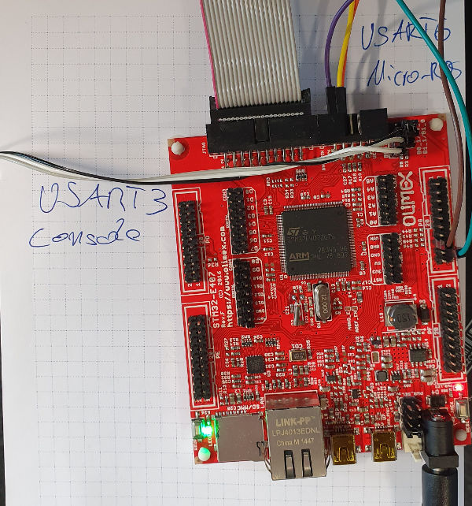

# Measurement approach taken

The `pingpong` scripts sends a `std_msgs/Header` message on the topic `uros_ping` and subscribes to the topic `uros_pong`. It is assumed that there is a node which subscribes to the ping topic and re-publishes the message to the pong topic *unchanged*. One example node that does is the [`uros_pong_server` example](https://github.com/micro-ROS/apps/tree/dashing/examples/uros_pong_server) from the Nuttx-version of Micro-ROS.

## What is sent

 1. The `stamp` field of the message contains, to a very good approximation, the time of message creation
 1. The `frame_id` field contains `ping <count> <timestamp>`, where 'ping' is just for preventing conflicts
    1. `count` counts message sent, and is initialized to 0 once the first message is *received* (this marks completed network setup)
    1. `timestamp` is the same timestamp contained in the `stamp` field, but as a string

## How the programm works


 1. It sets up publishers and receivers as described above and starts sending messages at 10Hz (by default)
 1. Upon *receiving* the first message, it goes to an `initialized` state 
 1. In the `initialized` state, it does the following
     1. A count from 0 is started and stored both internally and in the `frame_id` field (see above).
     1. Each message sent is appended to an internal list.
     1. Upon receiving a message, the `frame_id` field is parsed to yield the count and the string-version of the timestamp.
     1. The received message count is compared to the front of the internal list.
     1. If the received count is *larger* than the front,  internal messages are popped from the list until count is reached. The tool reports a *lost message* error for each message it had to skip.
     1. Once it found a match, it compares its content both internally (stamp to frame_id) and to what was stored upon sending.
     1. A log message is produced with the elapsed time and a status.
     1. Status is "OK" if the content matched, "ERR" otherwise.
     

Example status:
```
20164 OK 26409237 1579168155135103369 1579168155161512606 1579168155135103369 ""
```
This is the 20164'th message, status is OK, elapsed time is `26409237` nanoseconds (about 26ms), message stamp is `1579168155135103369` nanoseconds since epoch (2020-01-16 09:49:15.135103369), receive time is `1579168155161512606` (2020-01-16 09:49:15.161512606), and the frame time parsed from the frame_id field is `1579168155135103369` (same as what's in the stamp, as expected). The comment is therefore empty ("").
 

## Setup for the serial test

For the serial test, we use the [pingpong configuration](`https://github.com/micro-ROS/NuttX/tree/drive_base/configs/olimex-stm32-e407/pingpong`) (currently only found in the `drive_base` branch).

Cabling is as follows:
 * USART3 is used for the console -- this is not important, a USB console on OTG1 could be used just as well, but it takes longer to come up, so I prefer the serial console
 * USART6 is used for the connection to the agent. Note that I wired up the RTS/CTS pins to be able to use hardware flow-control. At the moment, it's running at 115200 baud.



## Agent-side configuration

Two things are important to get consistent and low results:

 1. The `micro_ros_agent` and the `pingpong` node are both started with `chrt -r 50`. This makes them real-time scheduled.
 1. When using FTDI-TTL232 cables, the latency_timer is 16ms by default. It needs to be reduced to 1ms, by doing `echo 1 > /sys/bus/usb-serial/devices/<device>/latency_timer`